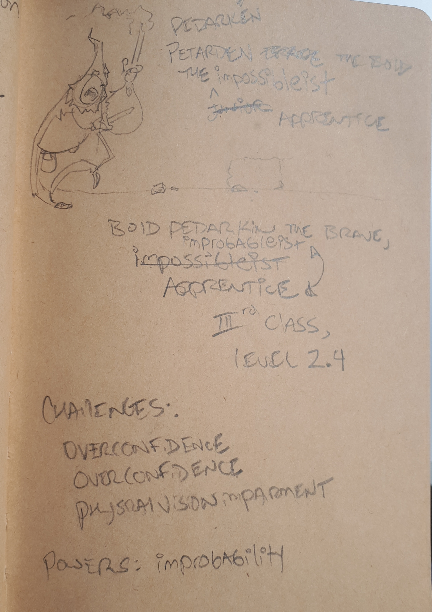

# General-Purpose Extensible Roleplaying Game (GPxRPG)

*Client*: Client Mike (CM) 
*Developer*: Developer Mike (DM)

## Concept
CM would like to build a small web-deployable app that allows users to create templated character profiles, like the sort one finds in Role-playing games. The character creation template is structured and somewhat opinionated, but is game system agnostic; the characters created are described primarily by descriptors (words, short phrases) which map to one or more categories which collecitvely describe characters belonging to a number of specific contexts (pen-and-paper rpgs, video games, storybooks). 

The app has one general function set: to permit users to create, modify, view, and share character ideas. What the user chooses to use the app for is entirely up to them. They can use it to aid in the creation of characters for their own games or stories, or describe themselves and/or their friends as part of a self-realization / confidence-building exercise. Intended audiences include but are not limited to:

* Game designers
* Writers
* Teachers
* Counsellors
* Parents and their kids

A major functional requirement of the app is to permit the styling and content (descriptor lists, character name chunks) to be externally managed by the users themselves, for example, in Git repositories. This will permit groups of users to customize the app to their specific needs, share their content, branch the content of other users, and so on. The web app's role will be as a display engine for this content, and (eventually) provide CRUD functionality within the UI, that will push updates back to the repo.

## Scope
The client needs the work done in two sprints initially. More sprints might follow, should the alpha prove interesting and successful.

### sprint 0: UX Proof of Concept
Sprint 1 must be ready to demonstrate by Monday, March 25 (or earlier if possible), as it will be required for interviewing purposes. Sprint 1 must produce an Angular app with interactive UI, partially functional services, some styling / imagery, and design documentation sufficient to express architectural concepts key to completing the alpha. 

### sprint 1: Data pipeline PoC
Sprint 2 must be ready to demonstrate by Friday, March 29 (or earlier), as it will demonstrate a key feature of the application: externalization of descriptor lists to an API-accessible datastore, such as Git, or Google docs. 

 

